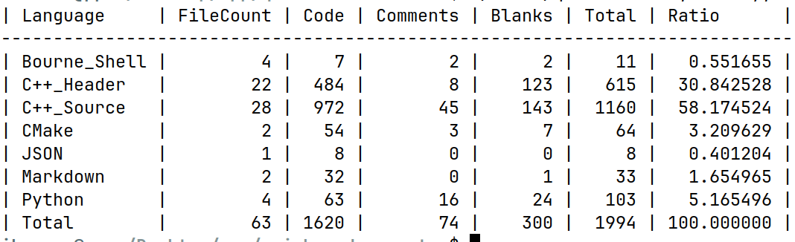
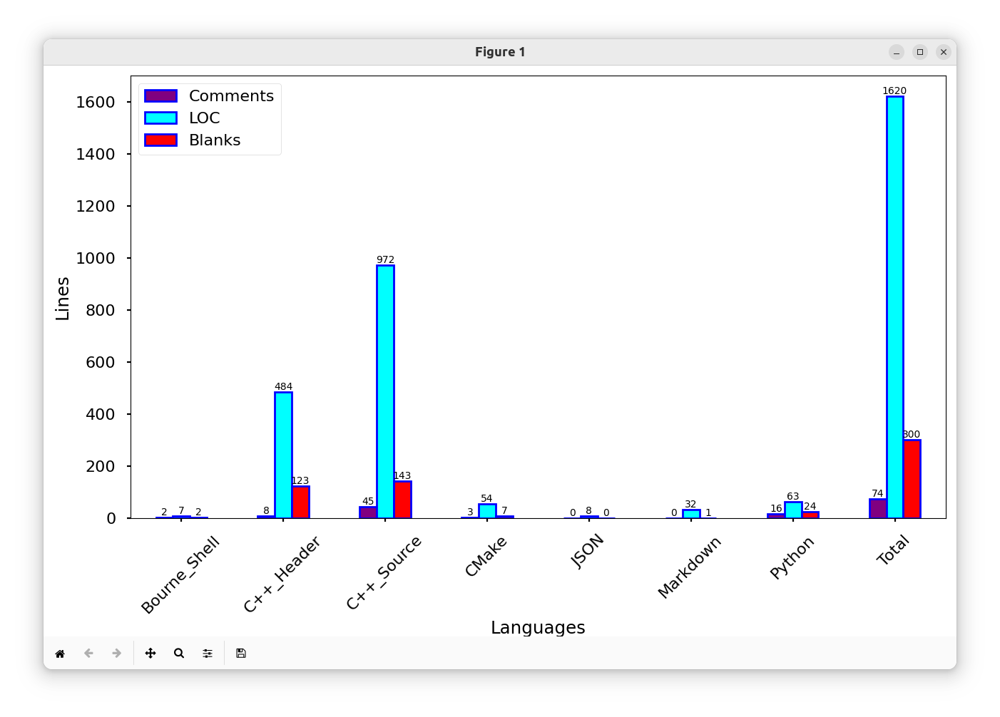
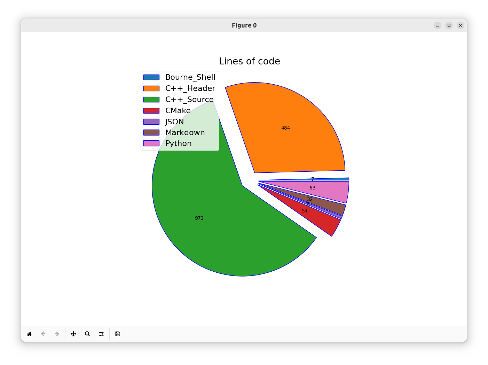
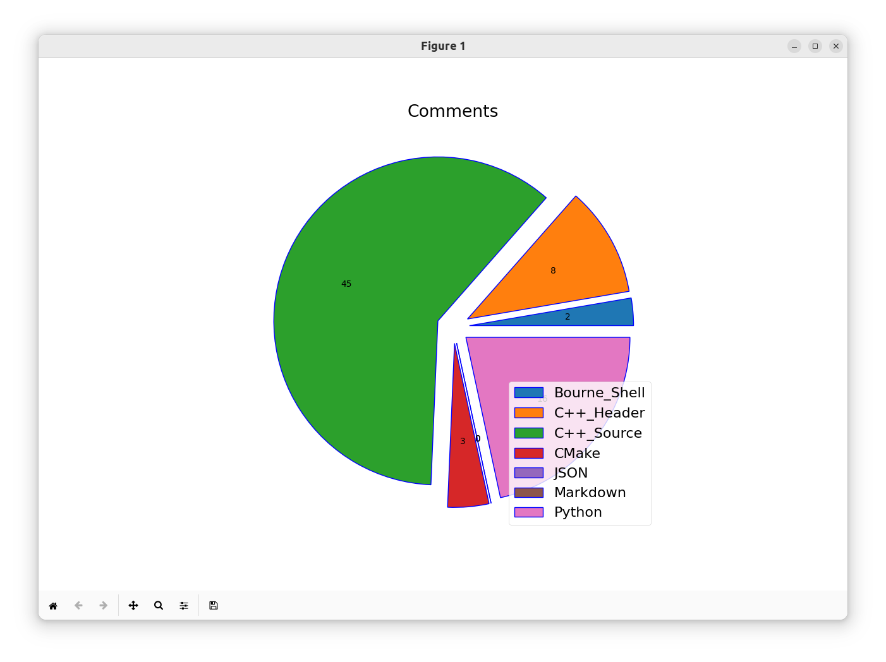
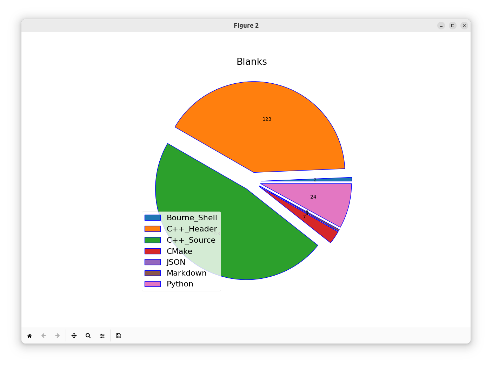

# quick-code-counter
Tool to count lines of code in a project

### Supported programming languages
- [x] Assembly,
 - [x] Bash,
 - [x] C#,
 - [x] C,
 - [x] C++,
  - [x] CMake,
  - [x] CSS,
  - [x] Git files,
 - [x] Go,
 - [x] Haskell,
 - [x] HTML,
 - [x] Java,
 - [x] Javascript,
 - [x] JSON files,
 - [x] Make,
 - [x] Markdown,
 - [x] Python,
 - [x] Zig

### Screenshots
- Output format : `table`

- Output format : `bar`

- Output format : `pie`

